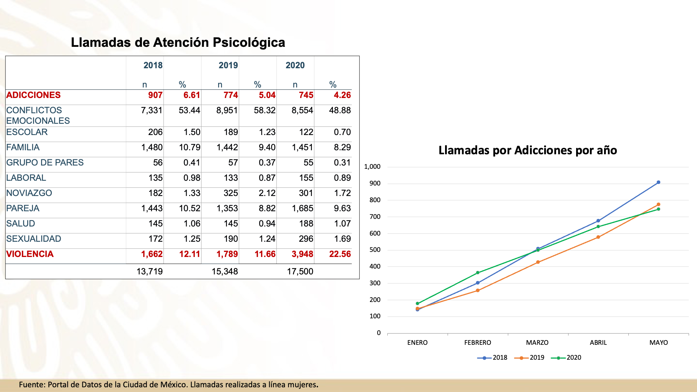

---
title: "Análisis de Llamadas de Emergencia 911 (CDMX 2021-2022)"
author: "Jorge Villatoro"
date: "`r format(Sys.Date(), '%d de %B de %Y')`"
output: 
  html_document:
    toc: true
    toc_depth: 3
    toc_float: true
    collapsed: true
    smooth_scroll: true
    theme: journal
    highlight: kate
    df_print: paged
    code_folding: show
    
---

```{r setup, include=TRUE}
# Opciones globales para los chunks de código
knitr::opts_chunk$set(echo = TRUE, eval = TRUE, warning = FALSE, message = FALSE)
```

---

# Introducción
La presente actividad consiste en el análisis de datos sobre las llamadas al 911, correspondientes al primer y segundo semestre de 2021, así como al primer semestre de 2022. En todas las actividades se agregó una distinción por semestre para observar las tendencias a lo largo del tiempo. Adicionalmente, se calculó el total general cuando este dato era de interés para el análisis.

La base de datos utilizada fue creada uniendo previamente las 3 bases de datos semestrales proporcionadas, resultando en el archivo archivo_combinado.csv. 

A continuación, se desarrollan los 5 ejercicios solicitados con algunas variantes que permiten analizar de manera más completa la información. 

# 1. Promedio de Incidentes por Categoría y Mes
Pregunta Guía: "Agrupar los incidentes por mes y alcaldía, y calcula el número promedio de incidentes por categoría."

---

```{r pregunta1}

library(dplyr)
library(lubridate)
library(ggplot2)
library(readr)
library(viridis)
library(forcats)

# Ruta del archivo
datos1 <- "archivo_combinado.csv"

# Cargar los datos
datos_911 <- read_csv(datos1)

# Procesar fechas
datos_911 <- datos_911 %>%
  mutate(
    fecha_creacion = ymd(fecha_creacion),
    anio = year(fecha_creacion),
    mes_num = month(fecha_creacion),
    mes = month(fecha_creacion, label = TRUE, abbr = FALSE, locale = "es_ES"),
    fecha_mes = as.Date(paste(anio, mes_num, "01", sep = "-"))
  )

# ========================
# Gráfico de calor (Heatmap) solo de marzo 2020 a abril 2022
# ========================

incidentes_promedio <- datos_911 %>%
  filter(
    !is.na(anio),
    !is.na(mes_num),
    !is.na(categoria_incidente_c4),
    fecha_creacion >= as.Date("2020-03-01"),
    fecha_creacion <= as.Date("2022-04-30")
  ) %>%
  group_by(anio, mes, categoria_incidente_c4, alcaldia_cierre) %>%
  summarise(total = n(), .groups = "drop") %>%
  group_by(anio, mes, categoria_incidente_c4) %>%
  summarise(promedio = mean(total), .groups = "drop")

grafico_heatmap <- ggplot(incidentes_promedio, aes(x = mes, y = fct_reorder(categoria_incidente_c4, promedio), fill = promedio)) +
  geom_tile(color = "white") +
  geom_text(aes(label = round(promedio, 1)), size = 2, color = "white") +
  scale_fill_viridis(name = "Promedio", option = "C") +
  facet_wrap(~anio) +
  theme_minimal(base_family = "sans") +
  theme(
    panel.background = element_rect(fill = "white", color = NA),
    plot.background = element_rect(fill = "white", color = NA),
    strip.background = element_rect(fill = "white"),
    axis.text.x = element_text(angle = 45, hjust = 1),
    panel.grid = element_blank()
  ) +
  labs(title = "Promedio mensual de incidentes Línea 911 (mar 2020-abr 2022)", x = "Mes", y = "Categoría")

# Mostrar heatmap
print(grafico_heatmap)

# ========================
# Gráfico de líneas (Tendencias) de los 5 incidentes más frecuentes desde diciembre 2020
# ========================

top5_incidentes <- datos_911 %>%
  filter(!is.na(categoria_incidente_c4)) %>%
  count(categoria_incidente_c4, sort = TRUE) %>%
  slice_max(n, n = 5) %>%
  pull(categoria_incidente_c4)

datos_lineas <- datos_911 %>%
  filter(
    categoria_incidente_c4 %in% top5_incidentes,
    fecha_creacion >= as.Date("2020-12-01"),
    !is.na(fecha_creacion)
  ) %>%
  mutate(
    mes_num = month(fecha_creacion),
    fecha_mes = as.Date(paste(anio, mes_num, "01", sep = "-"))
  ) %>%
  group_by(fecha_mes, categoria_incidente_c4) %>%
  summarise(total = n(), .groups = "drop")

grafico_lineas <- ggplot(datos_lineas, aes(x = fecha_mes, y = total, color = categoria_incidente_c4)) +
  geom_line(linewidth = 1.1) +
  geom_point() +
  scale_x_date(
    date_labels = "%b %Y",
    date_breaks = "2 months",
    limits = c(as.Date("2020-12-01"), NA)
  ) +
  labs(
    title = "Tendencia mensual de los 5 incidentes más frecuentes: Linea 911 CDMX",
    x = "Fecha",
    y = "Total de incidentes",
    color = "Categoría"
  ) +
  theme_minimal(base_family = "Arial") +
  theme(
    panel.background = element_rect(fill = "white", color = NA),
    plot.background = element_rect(fill = "white", color = NA),
    axis.text.x = element_text(angle = 45, hjust = 1)
  )

# Mostrar gráfico de líneas
print(grafico_lineas)
```

---

## Descripción Actividad 1:
Para esta actividad, se generaron dos gráficos. El primero es un mapa de calor (heatmap) que muestra el promedio de incidentes por categoría y mes, omitiendo el desglose por alcaldía para evitar una sobresaturación de información. El segundo es un gráfico de tendencias de los 5 incidentes más reportados para observar su fluctuación en el tiempo.

El mapa de calor muestra un rezago de eventos del año 2020, probablemente debido a afectaciones en el registro durante la pandemia y el cambio a teletrabajo. Centrándose en 2021 y 2022, los eventos más numerosos corresponden a disturbios, agresiones y servicios.

El gráfico de tendencias clarifica esta información. Se encontró que los eventos con mayor frecuencia en el periodo fueron: servicios, disturbios, agresiones, cuestiones administrativas y denuncias.

Disturbios: El pico se presentó en enero de 2021, un dato que podría considerarse atípico y que, como hipótesis, podría incluir datos acumulados del año anterior. Se observa otro pico en septiembre de 2021 con cerca de 25 mil reportes.

Servicios: Alcanzaron su máximo en el último cuarto de 2021 y durante marzo-abril de 2022, con más de 20 mil eventos.
Denuncias: Llegaron a su máximo en abril de 2022 con algo más de 15 mil reportes.
Cuestiones Administrativas: Su mayor número se registra en marzo de 2021, con aproximadamente 13 mil reportes.

Agresiones: Mostraron un comportamiento estable durante todo el periodo, con casi 10 mil denuncias mensuales.

# 2. Día de la Semana con Mayor Incidencia
Pregunta Guía: "Identificar el día de la semana con más incidentes y determinar el total de llamadas para ese día." 

---

```{r actividad2, include=TRUE}
library(ggplot2)
library(dplyr)
library(lubridate)
library(scales)

# Cargar datos
archivo <- read.csv("archivo_combinado.csv")

# Asegurar que fecha_creacion sea tipo Date
archivo$fecha_creacion <- as.Date(archivo$fecha_creacion)

# Filtrar y crear columna de semestre
archivo_filtrado <- archivo %>%
  filter(!is.na(fecha_creacion)) %>%
  mutate(
    semestre = case_when(
      year(fecha_creacion) == 2021 & month(fecha_creacion) <= 6 ~ "2021-1",
      year(fecha_creacion) == 2021 & month(fecha_creacion) >= 7 ~ "2021-2",
      year(fecha_creacion) == 2022 & month(fecha_creacion) <= 6 ~ "2022-1",
      TRUE ~ NA_character_
    ),
    dia_semana = wday(fecha_creacion, label = TRUE, abbr = FALSE, week_start = 1)
  ) %>%
  filter(!is.na(semestre))

# Contar incidentes por día y semestre
datos_dias <- archivo_filtrado %>%
  count(semestre, dia_semana)

# Graficar
p <- ggplot(datos_dias, aes(x = dia_semana, y = n, color = semestre, group = semestre)) +
  geom_line(linewidth = 1) +
  geom_point(size = 2) +
  geom_text(aes(label = n), vjust = -0.7, size = 2.5, show.legend = FALSE) +
  scale_y_continuous(expand = expansion(mult = c(0, 0.05)), labels = comma) +
  scale_color_manual(values = c("2021-1" = "blue", "2021-2" = "red", "2022-1" = "darkgreen")) +
  labs(x = "Día de la semana", y = "Número de incidentes", title = "Número de incidentes por día y semestre") +
  theme_minimal(base_size = 10) +
  theme(
    legend.title = element_blank(),
    legend.background = element_blank(),
    legend.key = element_blank(),
    legend.box.background = element_blank(),
    panel.grid.major = element_blank(),
    panel.grid.minor = element_blank(),
    panel.background = element_rect(fill = "white", color = NA),
    plot.background = element_rect(fill = "white", color = NA),
    axis.line.x = element_blank(),
    axis.line.y = element_blank()
  ) +
  geom_hline(yintercept = 0, color = "black") +
  geom_vline(xintercept = 0.5, color = "black")

# Mostrar gráfica
print(p)

```

---

## Descripción Actividad 2:
Se generó un gráfico de tendencias con el día de la semana en el eje X y el número de incidentes en el eje Y. Cada una de las tres líneas representa un semestre del periodo analizado.

Se observa claramente que el mayor número de llamadas ocurre los sábados y domingos, con un incremento que comienza desde el viernes. El comportamiento es muy similar en los tres semestres. 

El menor número de llamadas para el primer semestre de 2022 se debe a que los datos solo cubren de enero a abril. En su nivel más alto, durante el primer semestre de 2021, se registraron más de 134 mil llamadas los sábados y un número similar los domingos, con más de 132 mil.

# 3. Distribución de Incidentes por Hora del Día
Pregunta Guía: "Crear un análisis temporal que muestre la distribución de incidentes por hora del día para las categorías "DELITO", "EMERGENCIA" y "URGENCIA MÉDICA"."

---

```{r actividad3, include=TRUE}

library(dplyr)
library(ggplot2)
library(lubridate)
library(readr)

# Cargar los datos
archivo <- read_csv("archivo_combinado.csv")

# Preparar datos
datos_hora <- archivo %>%
  filter(!is.na(hora_creacion), !is.na(tipo_evento)) %>%
  filter(tipo_evento %in% c("DELITO", "EMERGENCIA", "URGENCIAS MEDICAS")) %>%
  mutate(
    hora_creacion_num = hour(hms(hora_creacion))
  ) %>%
  group_by(hora_creacion_num, tipo_evento) %>%
  summarise(frecuencia = n(), .groups = "drop")

datos_hora$hora_creacion_num <- factor(datos_hora$hora_creacion_num, levels = 0:23)

# Crear gráfico
grafico <- ggplot(datos_hora, aes(x = hora_creacion_num, y = frecuencia, color = tipo_evento, group = tipo_evento)) +
  geom_line(linewidth = 1) +
  geom_point(size = 3) +
  geom_text(aes(label = frecuencia), vjust = -0.7, size = 2.5) +
  scale_y_continuous(
    limits = c(0, 30000),
    breaks = seq(0, 30000, by = 5000),
    labels = scales::comma
  ) +
  scale_x_discrete(expand = expansion(add = c(0.5, 0.5))) +
  theme_minimal(base_size = 14) +
  theme(
    panel.grid.major.x = element_blank(),
    panel.grid.minor = element_blank(),
    panel.border = element_blank(),
    axis.line.x = element_line(color = "black", linewidth = 0.7, lineend = "round"),
    axis.line.y = element_line(color = "black", linewidth = 0.7, lineend = "round"),
    legend.position = "top",
    legend.title = element_blank(),
    legend.background = element_blank(),
    legend.key = element_blank(),
    plot.background = element_rect(fill = "white", color = NA)
  ) +
  labs(x = "Hora del día (0-23)", y = "Número de incidentes", title = "Incidentes por hora y categoría") +
  coord_cartesian(clip = "off")

# Mostrar gráfica
print(grafico)

```

---

## Descripción Actividad 3:
Para este análisis, se obtuvo un gráfico de tendencias donde el eje X representa la hora del día y el eje Y la frecuencia de los tres tipos de eventos solicitados. Se observa un patrón similar en los tres casos: un decremento en las primeras horas del día hasta las 6 a.m., momento en el que el número de llamadas comienza a subir. 

Sin embargo, los delitos presentan su mayor frecuencia hacia las 21 y 22 horas, con un incremento que inicia a partir de las 17 horas. Por su parte, las emergencias y urgencias médicas incrementan hasta las 15 horas, se mantienen estables hasta las 20 horas y luego comienzan a descender.

# 4. Tiempo de Atención de Incidentes
Pregunta Guía: "Calcular el tiempo promedio entre la creación y cierre del incidente (usa fecha_creacion y fecha_cierre). Así mismo, determinar el tiempo mínimo y máximo."

---

```{r actividad4, include=TRUE}

library(dplyr)
library(lubridate)
library(ggplot2)
library(forcats)

# Carga de datos (ajusta la ruta)
archivo <- read.csv("archivo_combinado.csv", stringsAsFactors = FALSE)

# Crear variable semestre basada en anio_creacion y mes_creacion
archivo <- archivo %>%
  mutate(
    semestre = case_when(
      anio_creacion == 2021 & mes_creacion %in% c("Enero", "Febrero", "Marzo", "Abril", "Mayo", "Junio") ~ "2021-1",
      anio_creacion == 2021 & mes_creacion %in% c("Julio", "Agosto", "Septiembre", "Octubre", "Noviembre", "Diciembre") ~ "2021-2",
      anio_creacion == 2022 & mes_creacion %in% c("Enero", "Febrero", "Marzo", "Abril", "Mayo", "Junio") ~ "2022-1",
      TRUE ~ NA_character_
    )
  )

# Combinar fecha y hora en datetime POSIXct
archivo <- archivo %>%
  mutate(
    fecha_hora_creacion = ymd_hms(paste(fecha_creacion, hora_creacion)),
    fecha_hora_cierre = ymd_hms(paste(fecha_cierre, hora_cierre))
  )

# Calcular tiempo de atención en minutos
archivo <- archivo %>%
  mutate(
    tiempo_atencion_min = as.numeric(difftime(fecha_hora_cierre, fecha_hora_creacion, units = "mins"))
  )

# Filtrar datos válidos para análisis (excluir duración 0 o menor)
archivo_filtrado <- archivo %>%
  filter(!is.na(semestre), !is.na(tiempo_atencion_min), tiempo_atencion_min > 0)

# Resumen por semestre
resumen_semestre <- archivo_filtrado %>%
  group_by(semestre) %>%
  summarise(
    promedio_min = mean(tiempo_atencion_min),
    minimo_min = min(tiempo_atencion_min),
    maximo_min = max(tiempo_atencion_min),
    .groups = "drop"
  ) %>%
  mutate(promedio_horas = promedio_min / 60)

# Resumen total
resumen_total <- archivo_filtrado %>%
  summarise(
    promedio_min = mean(tiempo_atencion_min),
    minimo_min = min(tiempo_atencion_min),
    maximo_min = max(tiempo_atencion_min)
  ) %>%
  mutate(
    semestre = "Total",
    promedio_horas = promedio_min / 60
  ) %>%
  select(semestre, everything())

# Combinar resumen total y por semestre
resumen_completo <- bind_rows(resumen_semestre, resumen_total)

# Reordenar factor para graficar en orden deseado
resumen_completo$semestre <- factor(resumen_completo$semestre,
                                    levels = c("2021-1", "2021-2", "2022-1", "Total"))

# Crear gráfico de barras del promedio de tiempo de atención (horas)
grafico_promedio <- ggplot(resumen_completo, aes(x = semestre, y = promedio_horas, fill = semestre)) +
  geom_col(show.legend = FALSE) +
  geom_text(aes(label = sprintf("%.2f", promedio_horas)), vjust = -0.5) +
  labs(
    title = "Promedio de Tiempo de Atención por Semestre",
    x = "Semestre",
    y = "Tiempo promedio (horas)"
  ) +
  theme_minimal() +
  theme(
    panel.background = element_rect(fill = "white", color = NA),
    plot.background = element_rect(fill = "white", color = NA)
  )

# Mostrar gráfico
print(grafico_promedio)

# Mostrar tabla resumen
print(resumen_completo)

```

---

## Descripción Actividad 4:
Al iniciar esta actividad, se observó que muchos eventos tenían una duración de 0, lo cual se supuso que podría ser un error en los datos. Por ello, se decidió analizar únicamente los eventos con una duración mínima de al menos un segundo. Para facilitar la visualización, el tiempo promedio se presenta en horas en el gráfico, aunque la tabla adjunta también muestra los valores en minutos.

El gráfico de barras muestra que el promedio más alto de atención se tuvo en el semestre 2022-1, con una duración promedio de 3 horas. Este valor es casi el doble que el de 2021-1 y más del doble que el de 2021-2. El promedio total de los tres semestres fue de aproximadamente 1 hora y 48 minutos.

En cuanto a los valores extremos, la duración máxima es muy alta, superando los 14,000 minutos en el semestre 2021-1, lo cual requeriría un análisis más detallado del evento específico.

# 5. Porcentaje de Falsas Alarmas
Pregunta Guía: "Determinar el porcentaje de llamadas que fueron clasificadas como ‘Falsa Alarma’."

---

```{r actividad5, include=TRUE}

library(DT)
library(dplyr)
library(lubridate)
library(ggplot2)
library(scales)
library(readr)

# Cargar los datos
archivo <- read_csv("archivo_combinado.csv")

# Preprocesamiento
archivo <- archivo %>%
  filter(!is.na(tipo_evento), !is.na(fecha_creacion)) %>%
  mutate(
    fecha_creacion = as.Date(fecha_creacion),
    anio = year(fecha_creacion),
    mes = month(fecha_creacion),
    dia_semana = wday(fecha_creacion, label = TRUE, abbr = FALSE, week_start = 1),
    semestre = case_when(
      anio == 2021 & mes <= 6 ~ "2021-1",
      anio == 2021 & mes >= 7 ~ "2021-2",
      anio == 2022 & mes <= 6 ~ "2022-1"
    )
  ) %>%
  filter(!is.na(semestre))

# Porcentaje de Falsas Alarmas por día de semana y semestre
falsas_porcentaje <- archivo %>%
  group_by(semestre, dia_semana) %>%
  summarise(
    total = n(),
    falsas = sum(tipo_evento == "FALSA ALARMA"),
    porcentaje = round(100 * falsas / total, 2),
    .groups = "drop"
  )

# Totales por semestre
totales_por_semestre <- archivo %>%
  group_by(semestre) %>%
  summarise(
    total = n(),
    falsas = sum(tipo_evento == "FALSA ALARMA"),
    porcentaje = round(100 * falsas / total, 2),
    .groups = "drop"
  )

# Gráfica de líneas
grafico_lineas <- ggplot(falsas_porcentaje, aes(x = dia_semana, y = porcentaje, color = semestre, group = semestre)) +
  geom_line(size = 1.2) +
  geom_point(size = 2.5) +
  labs(
    title = "Porcentaje de llamadas clasificadas como 'Falsa Alarma' por día",
    x = "Día de la semana",
    y = "Porcentaje (%)",
    color = "Semestre"
  ) +
  theme_minimal(base_size = 14) +
  scale_y_continuous(limits = c(0, NA), expand = c(0, 0)) +
  theme(
    legend.position = "top",
    legend.title = element_blank(),
    legend.background = element_blank(),
    panel.grid.minor = element_blank(),
    panel.grid.major.x = element_blank()
  )

# Gráfica de barras
grafico_barras <- ggplot(totales_por_semestre, aes(x = semestre, y = porcentaje, fill = semestre)) +
  geom_col(width = 0.6) +
  geom_text(aes(label = paste0(porcentaje, "%")), vjust = -0.5, size = 5) +
  labs(
    title = "Porcentaje total de llamadas 'Falsa Alarma' por semestre",
    x = "Semestre",
    y = "Porcentaje (%)"
  ) +
  scale_y_continuous(limits = c(0, max(totales_por_semestre$porcentaje) + 5), expand = c(0, 0)) +
  theme_minimal(base_size = 14) +
  theme(
    legend.position = "none",
    panel.grid.minor = element_blank(),
    panel.grid.major.x = element_blank()
  )

# Mostrar las gráficas
# print(grafico_lineas)
# print(grafico_barras)

# Crear tabla de porcentaje por día de la semana y semestre
tabla_dia_semestre <- archivo %>%
  group_by(semestre, dia_semana) %>%
  summarise(
    total_llamadas = n(),
    falsas_alarmas = sum(tipo_evento == "FALSA ALARMA"),
    porcentaje_falsa = round(100 * falsas_alarmas / total_llamadas, 2),
    .groups = "drop"
  ) %>%
  arrange(semestre, dia_semana)

# Crear tabla de totales por semestre
tabla_totales <- archivo %>%
  group_by(semestre) %>%
  summarise(
    total_llamadas = n(),
    falsas_alarmas = sum(tipo_evento == "FALSA ALARMA"),
    porcentaje_falsa = round(100 * falsas_alarmas / total_llamadas, 2),
    dia_semana = "TOTAL",  # para unirla fácilmente
    .groups = "drop"
  )

# Combinar ambas tablas en una sola
tabla_completa <- bind_rows(tabla_dia_semestre, tabla_totales) %>%
  select(semestre, dia_semana, total_llamadas, falsas_alarmas, porcentaje_falsa)

# Mostrar tabla
datatable(tabla_completa, options = list(pageLength = 12))
```

---

## Descripción Actividad 5:
El análisis de falsas alarmas muestra una ocurrencia casi nula a partir del segundo semestre de 2021, y una incidencia mínima (menor al 0.12%) en el primer semestre de 2021. Este resultado es inesperado, ya que en diversos países y según entrevistas con autoridades locales, se reporta una alta incidencia de este tipo de llamadas (cercana al 50%). Esto sugiere fuertemente que los datos de "falsa alarma" fueron, en su mayoría, removidos de la base de datos antes del análisis. Debido a la baja incidencia en los datos, es difícil generar gráficos que clarifiquen la situación, por lo que se optó por presentar la información en una tabla para mayor claridad.


# Conclusiones Generales
En resumen, los datos analizados son muy interesantes, aunque parecen contener algunas inconsistencias que necesitarían una revisión más detallada para obtener información más precisa.

Anexo: Análisis sobre Violencia Durante la Pandemia
Como comentario adicional, durante la pandemia, tuve la oportunidad de utilizar estos datos (específicamente la sección de llamadas de mujeres) con otras herramientas para analizar el consumo de drogas y la violencia, ante reportes de que esta última había incrementado debido al confinamiento.

La gráfica que sigue a este texto muestra un análisis del mismo periodo en tres años distintos para evaluar el impacto de la pandemia. Se observa una ligera caída en las llamadas por adicciones en 2020 (línea derecha). En contraste, el cuadro de la izquierda muestra un claro incremento en las llamadas por violencia, que pasaron de representar el 11.66% en 2019 al 22.56% en 2020. En términos absolutos, el número de llamadas por violencia se incrementó en más del doble. Estos son datos muy interesantes que merecen un análisis más profundo y difusión.

---

```{r Conclusiones, include=TRUE}

```

